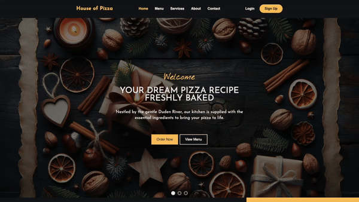
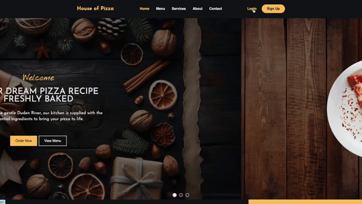
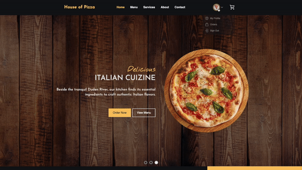
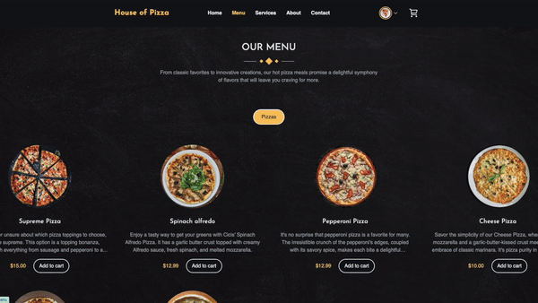
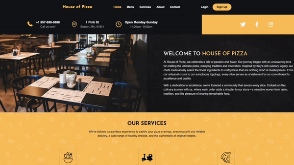
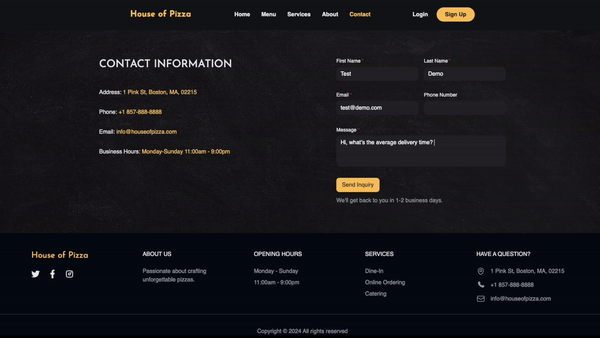

<a id='readme-top'></a>

# House-of-Pizza

<details>
  <summary>Table of Contents</summary>
  <ol>
    <li>
      <a href="#about">About</a>
      <ul>
        <li>
          <a href="#built-with">Built With</a>
        </li>
      </ul>
    </li>
    <li>
      <a href="#getting-started">Getting Started</a>
      <ul>
        <li>
          <a href="#prerequisites">Prerequisites</a>
        </li>
        <li>
          <a href="#installation">Installation</a>
        </li>
      </ul>
    </li>
    <li>
      <a href="#usage">Usage</a>
    </li>
    <li>
      <a href="#roadmap">Roadmap</a>
    </li>
    <li>
      <a href="#contact">Contact</a>
    </li>
  </ol>
</details>


## About

<div align="center">
  <h3>Home Page</h3>
  
<br />
  <h3>Login & SignUp</h3>
  
<br />
    <h3>User Portal</h3>
  
<br />
<h3>Menu & Checkout</h3>
  
<br />
<h3>Service</h3>
  
<br />
<h3>Contact Form</h3>
  
</div>
<br />


### Built With


<p align="right">
  (<a href="#readme-top">back to top</a>)
</p>


## Getting Started

### Prerequisites


```sh
npm install
```

### Installation

1. Clone the repo
   ```sh
   git clone https://github.com/FloraLZhang/House-of-Pizza
   ```
2. Install NPM packages
   ```sh
   npm install
   ```
3. Copy the `.exampleenv` file and rename it to `.env`

4. Run in dev environment.
   ```sh
   npm run dev
   ```

## Usage

House-of-Pizza is run on the designated port. It can also be accessed utilizing localhost:PORT directly in the browser.

<p align="right">(<a href="#readme-top">back to top</a>)</p>

<!-- ROADMAP -->

## Roadmap

- [x] Implement user authentication using NextAuth with support for email/password and Google sign-in.
- [x] Allow users to customize their profiles with basic information and preferences.
- [x] Create a straightforward and intuitive interface for users to browse menus and place orders seamlessly.
- [x] Leverage Stripe’s payment platform to build a secure checkout and payment process.
- [x] Develop a simple admin dashboard for managing restaurants, users, and orders efficiently.
- [x] Use EmailJS to handle customer inquiries and support requests effectively.
- [x] Utilize Cloudinary for storing and processing images related to menus.
- [x] Use MongoDB for storing user data, order details, and menu information.
- [x] Design a responsive and visually appealing UI using Tailwind CSS and NextUI components.
- [x] Integrate Google Maps’ API for store location.


<p align="right">(<a href="#readme-top">back to top</a>)</p>


## Contact
<h3 align='center'>Flora Zhang</h3>
<h4 align='center'>
  <a href="https://www.linkedin.com/in/floralz/"></a> |
  <a href="https://github.com/FloraLZhang"></a>
</h4>

<hr style="border: 1px solid #333">